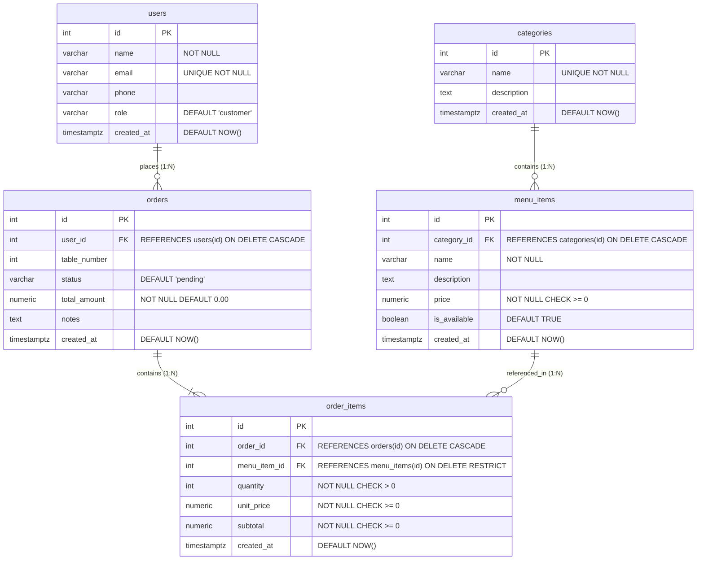

## 🗄️ Database Architecture & Relationships

Database: `resturant_db` in PostgreSQL.



### 2. Environment Setup
Configure your database credentials in `.env`:
```env
PORT=5000
PGHOST=127.0.0.1
PGPORT=5432
PGUSER=postgres
PGPASSWORD=postgres
PGDATABASE=resturant_db
```

### 3. Install Dependencies
```bash
npm install
```

### 4. Initialize & Seed Database
You can initialize the schema and populate sample data anytime by running:
```bash
npm run seed
```

### 5. Run the Server
```bash
# Production start
npm start

# Development mode with hot-reloading
npm run dev
```


## 📡 REST API Endpoints

### 1. Users (`/api/users`)
| Method | Endpoint | Description |
|---|---|---|
| `POST` | `/api/users` | Create user (`name`, `email`, `phone`, `role`) |
| `GET` | `/api/users` | List all users |
| `GET` | `/api/users/:id` | Get single user by ID |
| `PUT` | `/api/users/:id` | Update user details |
| `DELETE` | `/api/users/:id` | Delete user |

### 2. Categories (`/api/categories`)
| Method | Endpoint | Description |
|---|---|---|
| `POST` | `/api/categories` | Create category (`name`, `description`) |
| `GET` | `/api/categories` | List all categories |
| `GET` | `/api/categories/:id` | Get single category by ID |
| `PUT` | `/api/categories/:id` | Update category |
| `DELETE` | `/api/categories/:id` | Delete category |

### 3. Menu Items (`/api/menu-items`)
| Method | Endpoint | Description |
|---|---|---|
| `POST` | `/api/menu-items` | Create dish (`category_id`, `name`, `price`, `description`) |
| `GET` | `/api/menu-items` | List menu items (supports `?category_id=...`, `?search=...`) |
| `GET` | `/api/menu-items/category/:categoryId` | Convenience route for category filtering |
| `GET` | `/api/menu-items/:id` | Get single menu item |
| `PUT` | `/api/menu-items/:id` | Update menu item details or price |
| `DELETE` | `/api/menu-items/:id` | Delete menu item |

### 4. Orders (`/api/orders`)
| Method | Endpoint | Description |
|---|---|---|
| `POST` | `/api/orders` | Create order with multiple items (`user_id`, `items: [{menu_item_id, quantity}]`) |
| `GET` | `/api/orders` | List all orders with items & customer summary |
| `GET` | `/api/orders/:id` | Get full order details and itemized breakdown |
| `PUT` | `/api/orders/:id` | Update order (`status`, `table_number`, `notes`) |
| `DELETE` | `/api/orders/:id` | Delete order |

---
users	Accounts 
categories	
menu_items	
orders	
order_items