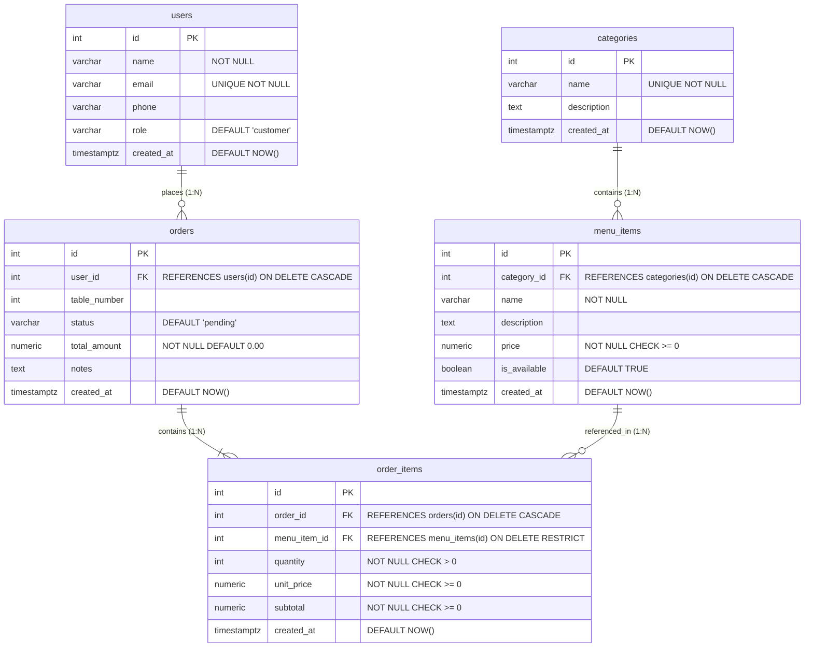

# 🍽️ Restaurant Management System — Full-Stack REST API & Frontend

A robust, full-stack Restaurant Management System built with **Node.js**, **Express.js**, **PostgreSQL** (`resturant_db`), and a dynamic vanilla JavaScript / HTML5 / CSS3 frontend.

Developed following the modular architectural structure of the `todo` project.

---

## 📁 Project Structure

```
fullstack-resturant/
├── .env                               # Environment variables (Database credentials, Port)
├── .env.example                       # Example environment file
├── .gitignore                         # Git ignore configuration
├── package.json                       # Scripts and dependencies
├── README.md                          # Complete documentation & presentation guide
├── API.md                             # Detailed REST API endpoint specification
│
├── public/                            # Interactive Frontend Client
│   ├── index.html                     # Responsive UI dashboard
│   ├── style.css                      # Modern responsive styling & design system
│   └── app.js                         # Dynamic API communication, cart, live log
│
├── src/                               # Backend Source Code
│   ├── app.js                         # Express application setup, routes, static files
│   ├── server.js                      # Server startup & automatic DB schema check
│   │
│   ├── config/
│   │   ├── env.js                     # Environment variable validation & parsing
│   │   └── index.js                   # Unified configuration export
│   │
│   ├── controllers/                   # Request handling & HTTP response logic
│   │   ├── userController.js          # Users CRUD
│   │   ├── categoryController.js      # Categories CRUD
│   │   ├── menuItemController.js      # Menu Items CRUD
│   │   └── orderController.js         # Orders & Order Items CRUD
│   │
│   ├── database/                      # PostgreSQL persistence layer
│   │   ├── pg.js                      # pg.Pool connection & schema manager
│   │   ├── store.js                   # SQL queries, joins, & transaction handlers
│   │   ├── schema.sql                 # DDL: tables, foreign keys, constraints
│   │   ├── seed.sql                   # Sample seed data for demo
│   │   └── seed.js                    # Seed script runner
│   │
│   ├── errors/
│   │   └── ApiError.js                # Custom error class with HTTP status codes
│   │
│   ├── middleware/                    # Express middleware
│   │   ├── error.js                   # Centralized error handler & 404 handler
│   │   ├── logger.js                  # Structured HTTP request logger
│   │   └── validation.js              # Incoming payload & param validators
│   │
│   ├── routes/                        # REST API routing
│   │   ├── userRoutes.js              # /api/users
│   │   ├── categoryRoutes.js          # /api/categories
│   │   ├── menuItemRoutes.js          # /api/menu-items
│   │   └── orderRoutes.js             # /api/orders
│   │
│   └── utils/
│       └── asyncHandler.js            # Async wrapper for clean controllers
│
├── postman/                           # API Testing Tools
│   └── Restaurant_Management_API.postman_collection.json
│
└── test/
    └── api.test.js                    # Comprehensive integration tests
```

---

## 🗄️ Database Architecture & Relationships

Database: `resturant_db` in PostgreSQL.



### Relational Features:
- **Foreign Keys**: Enforced across all relationships (`category_id`, `user_id`, `order_id`, `menu_item_id`).
- **Cascade Deletion**: Deleting a category removes associated menu items; deleting an order removes its order items.
- **Data Integrity Constraints**: `CHECK (quantity > 0)`, `CHECK (price >= 0)`, `UNIQUE (email)`, `UNIQUE (name)`.
- **Atomic Transactions**: Orders and their corresponding line items are created atomically via `BEGIN` / `COMMIT` / `ROLLBACK`.

---

## 🚀 Getting Started

### 1. Prerequisites
- [Node.js](https://nodejs.org/) (v18 or higher)
- [PostgreSQL](https://www.postgresql.org/) (Running on localhost port `5432` with database `resturant_db`)

### 2. Environment Setup
Configure your database credentials in `.env`:
```env
PORT=5000
PGHOST=127.0.0.1
PGPORT=5432
PGUSER=postgres
PGPASSWORD=postgres
PGDATABASE=resturant_db
```

### 3. Install Dependencies
```bash
npm install
```

### 4. Initialize & Seed Database
You can initialize the schema and populate sample data anytime by running:
```bash
npm run seed
```

### 5. Run the Server
```bash
# Production start
npm start

# Development mode with hot-reloading
npm run dev
```

The system will start and be accessible at:
- **Web App UI (Frontend):** `http://localhost:5000`
- **REST API Base URL:** `http://localhost:5000/api`
- **Health Check:** `http://localhost:5000/health`

### 6. Run Integration Tests
```bash
npm test
```
All endpoints and PostgreSQL constraints are thoroughly tested.

---

## 📡 REST API Endpoints

### 1. Users (`/api/users`)
| Method | Endpoint | Description |
|---|---|---|
| `POST` | `/api/users` | Create user (`name`, `email`, `phone`, `role`) |
| `GET` | `/api/users` | List all users |
| `GET` | `/api/users/:id` | Get single user by ID |
| `PUT` | `/api/users/:id` | Update user details |
| `DELETE` | `/api/users/:id` | Delete user |

### 2. Categories (`/api/categories`)
| Method | Endpoint | Description |
|---|---|---|
| `POST` | `/api/categories` | Create category (`name`, `description`) |
| `GET` | `/api/categories` | List all categories |
| `GET` | `/api/categories/:id` | Get single category by ID |
| `PUT` | `/api/categories/:id` | Update category |
| `DELETE` | `/api/categories/:id` | Delete category |

### 3. Menu Items (`/api/menu-items`)
| Method | Endpoint | Description |
|---|---|---|
| `POST` | `/api/menu-items` | Create dish (`category_id`, `name`, `price`, `description`) |
| `GET` | `/api/menu-items` | List menu items (supports `?category_id=...`, `?search=...`) |
| `GET` | `/api/menu-items/category/:categoryId` | Convenience route for category filtering |
| `GET` | `/api/menu-items/:id` | Get single menu item |
| `PUT` | `/api/menu-items/:id` | Update menu item details or price |
| `DELETE` | `/api/menu-items/:id` | Delete menu item |

### 4. Orders (`/api/orders`)
| Method | Endpoint | Description |
|---|---|---|
| `POST` | `/api/orders` | Create order with multiple items (`user_id`, `items: [{menu_item_id, quantity}]`) |
| `GET` | `/api/orders` | List all orders with items & customer summary |
| `GET` | `/api/orders/:id` | Get full order details and itemized breakdown |
| `PUT` | `/api/orders/:id` | Update order (`status`, `table_number`, `notes`) |
| `DELETE` | `/api/orders/:id` | Delete order |

---

## 💻 Frontend Features

Open `http://localhost:5000` to interact with:
1. **Interactive Menu & Category Filter**:
   - Filter menu items by clicking category pills (Appetizers, Main Course, Pizza & Pasta, etc.) or typing in the real-time search bar.
   - Shows dish name, category badge, description, price, and availability.
2. **Order Creation & Cart**:
   - Select customer from a live dropdown, pick table number, and add special instructions.
   - Click `+ Add` on dishes to add them to the order.
   - Adjust quantities with `+` / `−` buttons; auto-calculates total in real time.
   - Submits the order to `POST /api/orders` in PostgreSQL.
3. **Order Management**:
   - View all active orders, order totals, and items breakdown.
   - Update order status live (`pending` ➔ `in-progress` ➔ `completed` ➔ `cancelled`).
   - Modal popup showing full itemized breakdown (unit price, quantity, subtotal).
   - Delete order option.
4. **CRUD Management Panels**:
   - **Manage Menu**: Add, edit, or delete dishes with category assignment.
   - **Manage Categories**: Add, edit, or delete categories.
   - **Manage Customers**: Add, edit, or delete customers.
5. **Live Presentation Guide & Network Inspector**:
   - Tab dedicated to the Monday presentation showing the architecture diagram, relationship schema, and a **live terminal-style network monitor** that displays each HTTP request/response as you interact with the UI.

---

## Monday Presentation Guide (10 Key Demonstration Points)

During your presentation, use this checklist to demonstrate your work:

1. **PostgreSQL Database & Tables:**
   - Open psql or pgAdmin: Show `resturant_db` and list tables: `users`, `categories`, `menu_items`, `orders`, `order_items`.
   - Point out `src/database/schema.sql`.
2. **Table Relationships:**
   - Explain how `menu_items.category_id` references `categories.id` (`ON DELETE CASCADE`).
   - Explain how `orders.user_id` references `users.id`.
   - Explain how `order_items` connects `orders` (1-to-many) and `menu_items` (many-to-one).
3. **Express API Architecture:**
   - Show `src/server.js`, `src/app.js`, and how routes are separated into `src/routes/`.
   - Mention error handling in `src/middleware/error.js` and validation in `src/middleware/validation.js`.
4. **API Endpoints:**
   - Show the Postman collection in `postman/Restaurant_Management_API.postman_collection.json`.
   - Demonstrate `GET /health` and `GET /api/menu-items`.
5. **Frontend Interface:**
   - Open `http://localhost:5000/menu` in the browser.
   - Show how the menu is dynamically loaded from PostgreSQL.
6. **Creating & Viewing Menu Items:**
   - Navigate to `http://localhost:5000/manage-menu`.
   - Click "+ Add New Menu Item", create a dish, and show it appears both in the table and on the Menu & Order page.
7. **Creating an Order:**
   - Navigate to `http://localhost:5000/menu`.
   - Select a customer, enter table number, click "+ Add" on 2-3 dishes, adjust quantities, and click "Submit Order to Kitchen".
8. **Viewing an Order and Its Items:**
   - Navigate to `http://localhost:5000/orders`.
   - Show the newly created order, its items summary, and click the view icon to see the itemized breakdown modal (dish name, quantity, unit price, subtotal).
9. **How Frontend Communicates with Backend:**
   - Open Chrome DevTools → Network tab.
   - Interact with the UI and show each `GET`, `POST`, `PUT`, `DELETE` request being sent to `/api/*` with JSON responses.
10. **Data Flow (PostgreSQL → Express REST API → Frontend):**
    - Explain: Database query runs in `src/database/store.js` using `pg.query()`, returns rows to Express controller, serialized to JSON response, received by frontend `fetch()` in `app.js`, and rendered into DOM elements.

